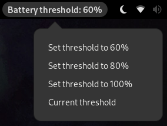

# Battery Threshold gnome-shell-extension

A simple extension for gnome-shell that let easily set a threshold to limit battery charge level.

This extension uses "pkexec" since sudo permissions are needed to change the threshold level.

Tested on Fedora Silverblue 35 (gnome-shell 3.41) on an Asus Vivobook.